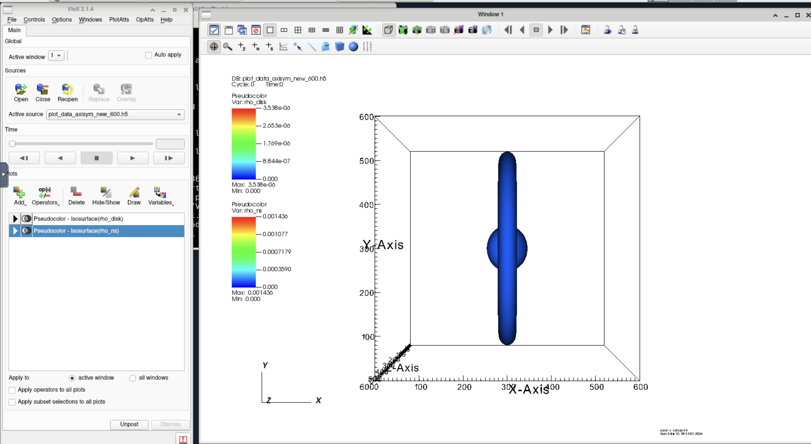
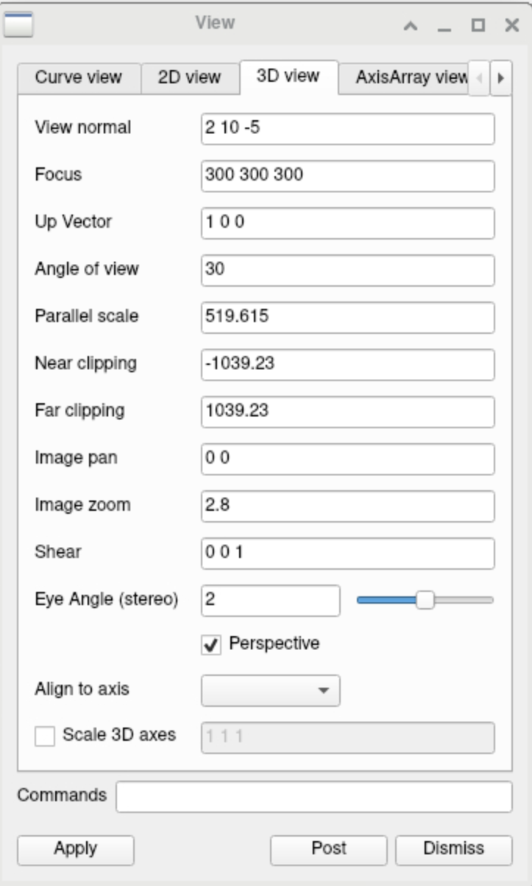
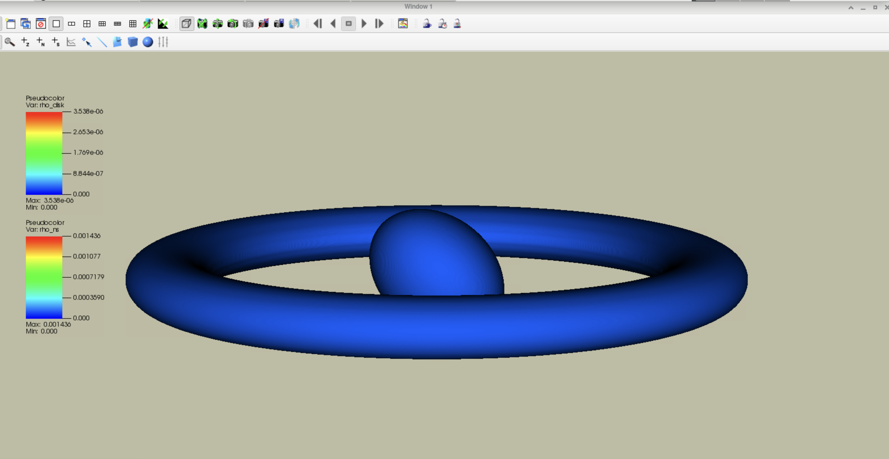
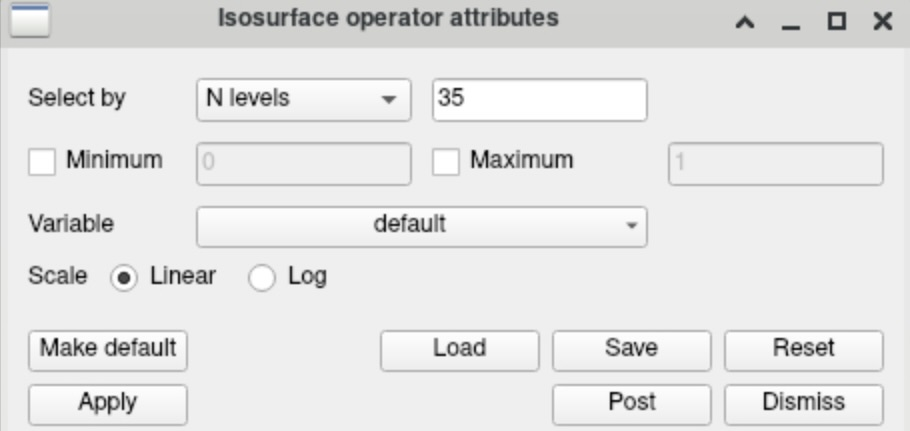
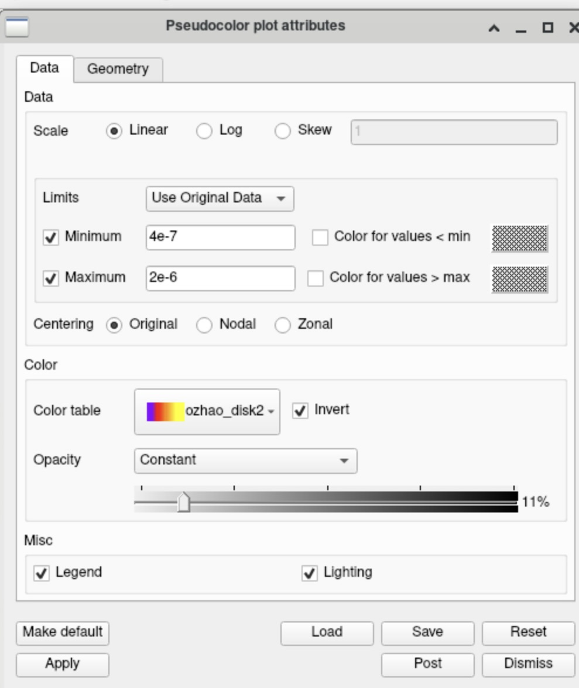
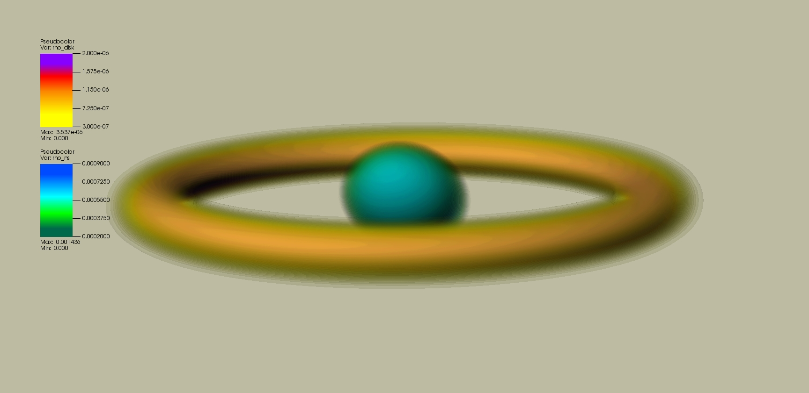

# Case Study: Axisymmetric Neutron Star with Disk

In this case study we examine the visualization of an axisymmetric neutron star–disk system using VisIt. The purpose of this section is to document the plotting workflow and the visualization settings used to generate reproducible figures. The data used here correspond to initial data of a rotating neutron star surrounded by an accretion disk.

In this tutorial we primarily demonstrate the procedure using the Anvil GUI, 
which was the environment I used for this case. Corresponding CLI commands 
are also provided where applicable.

The dataset used in this section was loaded from

`plot_data_axisym_new_600.h5`

(which can be found in my GitHub repository if needed for practice).

**Note:** The codes used to convert spherical COCAL initial data into Cartesian data and HDF5 format can be found on GitHub in  
`Illinois-Relativity-Group/COCAL_Cartesian`.

For this system we generate three types of visualizations:

- raw density plots
- normalized density plots (density divided by the maximum value)
- logarithm of the normalized density

Since the first two types follow very similar procedures, we focus on two representative cases in this section:

- raw density
- logarithm of the normalized density

The main visualization consists of pseudocolor plots of the disk and neutron star, with isosurface operators applied to highlight their structures.

---

## Plot Components

The visualization of this case was constructed using the following VisIt pipeline:

- **Pseudocolor** plot of `rho_ns`  
  (or `rho_ns_norm`, `rho_ns_log_norm`)
- **Pseudocolor** plot of `rho_disk`  
  (or `rho_disk_norm`, `rho_disk_log_norm`)
- **Isosurface** operator applied to the neutron star pseudocolor plot
- **Isosurface** operator applied to the disk pseudocolor plot
- **Vector** plot of the neutron star spin


The initial procedures should be familiar if the previous sections have been read. 
We therefore proceed directly to the stage where raw isosurface plots are created 
for both the disk and the neutron star, as shown in the figure below.



<div style="text-align: center;">
<p>Figure 1: Raw isosurface visualization of the axisymmetric neutron star–disk system.</p>
</div>

Before proceeding further, we note a few visualization settings that help improve the clarity of the plots. 
First, we remove the coordinate axes and bounding boxes so that only the color table remains visible 
(the color table will also be refined later).

In the VisIt GUI this can be done by navigating to

**Controls → Annotations**

and disabling the corresponding options

The corresponding CLI commands are

```python
AnnotationAtts = AnnotationAttributes()
AnnotationAtts.axes3D.visible = 0
AnnotationAtts.axes3D.triadFlag = 0
AnnotationAtts.axes3D.bboxFlag = 0
AnnotationAtts.userInfoFlag = 0
AnnotationAtts.databaseInfoFlag = 0
SetAnnotationAttributes(AnnotationAtts)
```

Now your plot should look something like this.


The second thing is to change background color. This can be achieved by 

**Controls → Annotations → Colors → Background color**.

In this example the background color used was 
<span style="background-color:#bdbca2; padding:3px 10px; border:1px solid #666;">#bdbca2</span>
for reference.

The equivalent CLI commands are:

```python
AnnotationAtts = AnnotationAttributes()
AnnotationAtts.backgroundMode = AnnotationAtts.Solid
AnnotationAtts.backgroundColor = (189, 188, 162, 255)
SetAnnotationAttributes(AnnotationAtts)
```


Then, we need to adjust the view of the plot for clarity.
On GUI, this can be done by

**Controls → View**

The setting used for the example is shown below. 
The equivalent CLI commands were:

```python
View3DAtts = View3DAttributes()
View3DAtts.viewNormal = (2, 10, -5)
View3DAtts.focus = (300, 300, 300)
View3DAtts.viewUp = (1, 0, 0)
View3DAtts.viewAngle = 30
View3DAtts.parallelScale = 519.615
View3DAtts.imagePan = (0, 0)
View3DAtts.imageZoom = 2.8
View3DAtts.perspective = 1
SetView3D(View3DAtts)
```

A more detail explanation of the different parameters can be found on the official tutorial of Vislt: 

https://visit-sphinx-github-user-manual.readthedocs.io/en/develop/using_visit/MakingItPretty/View.html

<p align="center">
  
</p>

<p align="center"><em>Figure 2: View Setting.</em></p>


Now your plot should look something like this.



<div style="text-align: center;">
<p>Figure 3: Vislt after setup.</p>
</div>

After the set up we can get into the main procedure.

## Isosurface, Opacity, and Density Range Settings

The first step should be loading up the color tables you will be using for neutron star and disk densities.

### Isosurface Levels


Then, to better emphasize the structural features of the system, several visualization parameters can be adjusted. 

One of the most important parameters is the **number of isosurface levels**, which controls how many contour shells are rendered.

In GUI, this can be done by 

**Isosurface operator attributes → Select by -- N level --**

<div style="text-align: center;">
    
    <p>Figure 4: GUI Isosurface Level Setting.</p>
</div>


The settings for CLI used for this example are shown below:

```python
IsosurfaceAtts = IsosurfaceAttributes()
IsosurfaceAtts.contourNLevels = 50
IsosurfaceAtts.contourMethod = IsosurfaceAtts.Level
IsosurfaceAtts.scaling = IsosurfaceAtts.Linear
SetOperatorOptions(IsosurfaceAtts, 0, 0)
```

### Opacity Settings

The next parameter you wanna play with is the **opacity** setting of the color bar. 

The next parameter that can be adjusted 
Opacity controls how transparent the rendered surface is, and therefore determines how easily internal structures and overlapping surfaces can be seen.

In the GUI this can be adjusted through

**Pseudocolor → Opacity**

For this example, a ***Ramp*** opacity profile was used with a representative value around `22%` for neutron star density. 
For disk density, I used a ***Constant*** opacity around `11%`.

### Density Range (Min/Max)

Finally, you might wanna play with ***min*** and ***max*** in **Psudocolor**.


<div style="text-align: center;">
    
    <p>Figure 5: GUI Pseudocolor settings.</p>
</div>


The equivalent CLI commands for **Pseudocolor** settings of neutron star density are shown below as an example:

```python
PseudocolorAtts = PseudocolorAttributes()
PseudocolorAtts.minFlag = 1
PseudocolorAtts.min = 2e-4
PseudocolorAtts.maxFlag = 1
PseudocolorAtts.max = 1e-3
PseudocolorAtts.colorTableName = "ozhao_ns2"
PseudocolorAtts.invertColorTable = 1
PseudocolorAtts.opacityType = PseudocolorAtts.Ramp
PseudocolorAtts.opacity = 0.223529
SetPlotOptions(PseudocolorAtts)
```


The equivalent CLI commands for **Pseudocolor** settings of disk density are:


```python
PseudocolorAtts = PseudocolorAttributes()
PseudocolorAtts.minFlag = 1
PseudocolorAtts.min = 4e-7
PseudocolorAtts.maxFlag = 1
PseudocolorAtts.max = 2e-6
PseudocolorAtts.colorTableName = "ozhao_disk2"
PseudocolorAtts.invertColorTable = 1
PseudocolorAtts.opacityType = PseudocolorAtts.Constant
PseudocolorAtts.opacity = 0.117647
SetPlotOptions(PseudocolorAtts) 
```


Note: the numbers and options I provided are just for references. The exact settings should be experimented with patience.


Finally, your plot might look something similar to this.



<div style="text-align: center;">
<p>Figure 6: Raw density plot</p>
</div>


